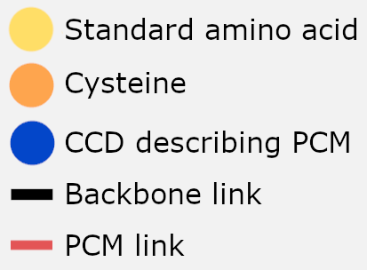
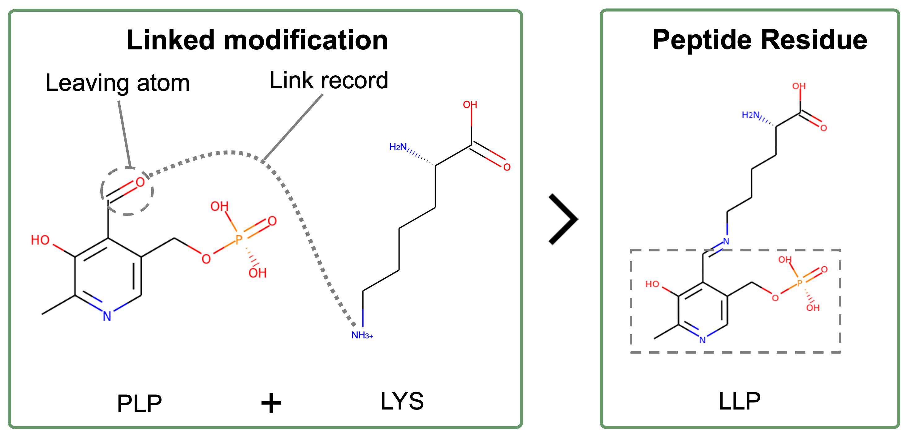

# Protein Modifications

## Sections

- [Glossary of Terms](#glossary-of-terms)
- [Figure Legend](#figure-legend)
- [Introduction](#introduction)
- [New CCD Data Categories](#new-ccd-data-categories)
- [New mmCIF Data Categories](#new-mmcif-data-categories)
- [Acknowledgements](#acknowledgements)

## Glossary of Terms

PCM - Protein chemical modification

PTM - Post-translational modification

## Figure Legend

## Introduction

As of May 2024, the PDB archive stores >80,000 macromolecular structures that contain at 
least one protein chemical modification (PCM). These modifications are highly diverse, ranging from small 
compounds (e.g. methylation) to very large polymeric compounds (e.g. glycosylation). This 
makes it challenging to represent them in format that is consistent and accessible  to 
the community.

This year, all entries containing PCMs will be remediated to standardize 
and enrich the PCM data that they contain. This process will involve: 

- A standardized representation of all PCMs observed in PDB entries
- New PDB entry data categories that summarise the PCMs the entry contains
- New CCD definition data categories that summarise the PCMs described by the chemical unit
- Enriched descriptions of the PCMs described in the PDB archive

The standardization and enrichment of PCM information across all PDB 
entries will make PCM data more Findable, Accessible, Interoperable and 
Reusable (FAIR). Together, this will support the wider usage and analysis of protein 
modification data in the PDB archive.  

## New CCD Data Categories

To provide a summary of the PCMs that are available in the PDB archive,
new data categories have been added to CCD files to state whether the CCD can be used to
describe a PCM and to list all the PCMs that a CCD can describe.

### _chem_comp.pdbx_pcm

Can the CCD be used to describe a PCM?

| Accepted values |
|-----------------|
| Y               |
| N               |

When the value is set to N, this indicates that this CCD should never be used to 
describe a PCM and instead another CCD exists that can be used to 
describe the modification. For example, the modification of lysine with pyridoxal 
phosphate can be handled in two ways:

In this example, the value of _chem_comp.pdbx_pcm is set to 'Y' for LLP and 'N' for PLP. 
This ensures that PLP is not used to describe this PCM.

### _pdbx_chem_comp_pcm

This new category contains a list of all the PCMs that the CCD can 
describe along with additional information about the modification.

For example, in the phosphoserine CCD (SEP) this category contains the following data:

| pcm_id | comp_id | modified_residue_id | type            | category                   | position              | polypeptide_position | comp_id_linking_atom | modified_residue_id_linking_atom | uniprot_specific_ptm_accession | uniprot_generic_ptm_accession |
|--------|---------|---------------------|-----------------|----------------------------|-----------------------|----------------------|----------------------|----------------------------------|--------------------------------|-------------------------------|
| 1      | SEP     | SER                 | Phosphorylation | Named protein modification | Amino-acid side chain | Any position         | .                    | .                                | PTM-0253                       | ?                             |

Where a CCD describes multiple modifications, this category contains multiple rows:

| pcm_id | comp_id | modified_residue_id | type          | category                   | position              | polypeptide_position | comp_id_linking_atom | modified_residue_id_linking_atom | uniprot_specific_ptm_accession | uniprot_generic_ptm_accession |
|--------|---------|---------------------|---------------|----------------------------|-----------------------|----------------------|----------------------|----------------------------------|--------------------------------|-------------------------------|
| 1      | CSD     | CYS                 | Oxidation     | Named protein modification | Amino-acid side chain | Any position         | .                    | .                                | PTM-0108                       | ?                             |
| 2      | CSD     | CYS                 | Hydroxylation | Named protein modification | Amino-acid side chain | Any position         | .                    | .                                | PTM-0108                       | ?                             |

For linked modification groups, the chemical unit can be linked to multiple amino 
acid residues to describe different PCMs. Within _pdbx_chem_comp_pcm, 
each of these PCMs is described by a separate row. For example, PLM is 
used to describe palmitoylation, a type of lipidation:

| pcm_id | comp_id | modified_residue_id | type           | category         | position              | polypeptide_position | comp_id_linking_atom | modified_residue_id_linking_atom | uniprot_specific_ptm_accession | uniprot_generic_ptm_accession |
|--------|---------|---------------------|----------------|------------------|-----------------------|----------------------|----------------------|----------------------------------|--------------------------------|-------------------------------|
| 1      | PLM     | LYS                 | Palmitoylation | Lipid/lipid-like | Amino-acid side chain | Any position         | C1                   | NZ                               | PTM-0197                       | ?                             |
| 2      | PLM     | CYS                 | Palmitoylation | Lipid/lipid-like | Amino-acid backbone   | N-terminal           | C1                   | N                                | PTM-0222                       | ?                             |
| 3      | PLM     | GLY                 | Palmitoylation | Lipid/lipid-like | Amino-acid backbone   | N-terminal           | C1                   | N                                | PTM-0223                       | ?                             |
| 4      | PLM     | SER                 | Palmitoylation | Lipid/lipid-like | Amino-acid side chain | Any position         | C1                   | OG                               | PTM-0241                       | ?                             |
| 5      | PLM     | THR                 | Palmitoylation | Lipid/lipid-like | Amino-acid side chain | Any position         | C1                   | OG1                              | PTM-0242                       | ?                             |
| 6      | PLM     | CYS                 | Palmitoylation | Lipid/lipid-like | Amino-acid side chain | Any position         | C1                   | SG                               | PTM-0281                       | ?                             |
| ...    |         |                     |                |                  |                       |                      |                      |                                  |                                |                               |

A full description of all the items in this category can be found in the 
[PDBx/mmCIF dictionary definition for this category](https://mmcif.wwpdb.org/dictionaries/mmcif_pdbx_v50.dic/Categories/pdbx_chem_comp_pcm.html)

### Protein Modification Categories

Due to the diversity of PCMs, not all modifications can be handled 
using the same approach. Therefore, PCMs have been grouped into broad
categories annotated in _pdbx_chem_comp_pcm.category. Within each category, the protein 
modifications are handled consistently.

There are 4 approaches to handling PCMs:

| Approach                  | Categories                                                                                                                                                                                | Examples                                                              |
|---------------------------|-------------------------------------------------------------------------------------------------------------------------------------------------------------------------------------------|-----------------------------------------------------------------------|
| Part of peptide residue   | Chromophore/chromophore-like   Named protein modification   Non-standard residue                                                                                                  | Phosphoserine (SEP)   N-Trimethyl-lysine (M3L)                    |
| Linked to peptide residue | ADP-Ribose   Biotin   Carbohydrate   Covalent chemical modification   Crosslinker   Flavin   Heme/heme-like   Lipid/lipid-like   Nucleotide monophosphate | N-acetyl-D-glucosamine (NAG)   Palmitic acid (PLM)                |
| Direct covalent bond      | Disulfide bridge  Isopeptide bond   Non-standard linkage                                                                                                                          | Cysteine-Cysteine covalent bond   Lysine-Asparagine covalent bond |
| Part of peptide sequence  | Terminal acetylation   Terminal amidation                                                                                                                                             | Acetyl group (ACE)   Amino group (NH2)                            |

A full list of the values in the controlled vocabulary of this category can be found in the 
[PDBx/mmCIF dictionary definition for this item](https://mmcif.wwpdb.org/dictionaries/mmcif_pdbx_v50.dic/Items/_pdbx_chem_comp_pcm.category.html)

#### Modifications that are part of the peptide residue

Most small and well-known PCMs are in the category 'Named protein modification'.
This covers all PTMs that are not explicitly covered by another category, including 
phosphorylation and methylations. 

Small modifications are handled as part of the peptide residue to ensure that they are grouped into 
chemical units that are meaningful and findable by the community. For example, it is 
easier to find N-Trimethyl-lysine as a single chemical unit rather than a standard 
lysine linked to three separate methyl groups.

Chromophores and other non-standard residues are also handled using this approach. This 
is because they cannot be unambiguously split into a standard amino acid and the modification 
group.

#### Modifications that are linked to a peptide residue

Not all modifications can be defined as part of the peptide residue and instead need to
have a separate CCD definition to describe the modification group. There are multiple 
reasons this might be the case:

| Rationale                                                  | Categories                                                             |
|------------------------------------------------------------|------------------------------------------------------------------------|
| Modification is too large                                  | Lipid/lipid-like, Nucleotide monophosphate, ADP-ribose, Biotin, Flavin |
| Modification is multi-unit or branched                     | Carbohydrate                                                           |
| Modification is synthetic such as a covalent inhibitor     | Covalent chemical modification                                         |
| Modification covalently bonds to multiple peptide residues | Crosslinker, Heme/heme-like                                            |

In these cases, the CCD that describes the modification group contains the details of 
all the PCMs that it can form. For example, the CCD for palmitic acid (PLM) 
describes all the palmitoylations observed in the PDB archive.

#### Modifications that are direct covalent bonds

Some PCMs have no modification group and are instead direct covalent 
bonds between two peptide residues. The most common example of this are disulfide 
bridges, however, there are other such modifications, including isopeptide 
bonds, Selenocysteine-Selenocysteine bonds and peptide 
cyclisation bonding.

There are no CCDs that describe these modification groups because the modification 
contains no atoms. Therefore, these modifications are annotated in the mmCIF entry file
that describes the macromolecular structure, but not in any CCD definition.

#### Modifications that are part of the peptide sequence

These are modifications that are both linked to the peptide residue they modify, but also
part of the polypeptide sequence. Terminal acetylation and amidation are the only 
modifications that are handled in this way. 

### Protein Modification Types

The PCM categories described above define broad groups of modifications.
Within each modification category, more specific descriptions of the modification are 
defined in the item _pdbx_chem_comp_pcm.type. For example, within the category, 
'Lipid/lipid-like' there are the modifications 'Palmitoylation', 'Myristoylation', etc.

These types are assigned using a controlled vocabulary that precisely indicate 
how the peptide residue has been chemically modified. When used in conjunction 
with pdbx_chem_comp_pcm.categories, the user is able to obtain both specific  
information about the modification and the broader category this modification 
fits within.

The 'Named protein modification' category includes most small PTMs and so contains the 
largest number of modification types, including: 
- Phosphorylation
- Methylation
- Oxidation
- Hydroxylation

Not all modifications are assigned a PCM type. This can be for several 
reasons, including:

| Rationale                                                                   | Examples                      |
|-----------------------------------------------------------------------------|-------------------------------|
| The category fully describes the modification                               | Disulfide Bridges             |
| It is difficult to distinguish the modification group from the amino acid   | Non-standard residues         |
| The modification group is not well-known or is unique to a single structure | Heme and chromophore variants |

A full list of the values in the controlled vocabulary of this category can be found in the 
[PDBx/mmCIF dictionary definition for this item](https://mmcif.wwpdb.org/dictionaries/mmcif_pdbx_v50.dic/Items/_pdbx_chem_comp_pcm.type.html)

### Enriched Annotation

In addition to the annotation of a PCM's type and category, additional 
information is recorded to describe the modification. 

#### Modified residue

This defines the residue that has been modified as part of the PCM.
It is annotated in the item _pdbx_chem_comp_pcm.modified_residue_id and can have the 
following values:

For PCMs that are defined as part of a peptide residue, this value is 
the parent residue CCD ID. For example, the parent of phosphoserine (SEP) is serine (SER).

For linked modifications it is the peptide residue that the modification group is 
attached to. For example, in the description of N6-palmitoyl lysine the modified residue 
is LYS.

#### Linking atoms

For linked PCMs, the two atom names that link the peptide residue to 
the modification group are annotated. 

These are annotated in the CCD items: 
- _pdbx_chem_comp_pcm.comp_id_linking_atom
- _pdbx_chem_comp_pcm.modified_residue_id_linking_atom

#### Position

This describes the position on the amino acid residue that the modification occurs on.
It is annotated in the item _pdbx_chem_comp_pcm.position and can have the following 
values:

| Value                              |
|------------------------------------|
| Amino-acid backbone                |
| Amino-acid side chain              |
| Amino-acid side chain and backbone |

#### Polypeptide Position

This describes where in the polypeptide sequence the modification can occur. 
Some modifications can only occur on either the N-terminus or C-terminus of a protein. 
It is annotated in the item _pdbx_chem_comp_pcm.polypeptide_position and can have the 
following values:

| Value        |
|--------------|
| Any position |
| N-terminal   |
| C-terminal   |

#### UniProt Cross-referencing

These provide direct mappings to the UniProt PTM definitions defined in the 
[UniProt Controlled Vocabulary of Posttranslational Modifications](https://ftp.uniprot.org/pub/databases/uniprot/current_release/knowledgebase/complete/docs/ptmlist).

Within the new CCD category there are two items that map these values to the CCD ID:
- _pdbx_chem_comp_pcm.uniprot_specific_ptm_accession
- _pdbx_chem_comp_pcm.uniprot_generic_ptm_accession

There is some overlap in the PTM definitions in the UniProt controlled vocabulary. This 
is because some of the UniProt definitions refer to PCMs that are not
chemically unique.

For example there are 3 definitions for Phosphohistidine: 

| Name                    | UniProt PTM ID | CCD ID  |
|-------------------------|----------------|---------|
| Phosphohistidine        | PTM-0252       | HIP/NEP |
| Pros-phosphohistidine   | PTM-0260       | HIP     |
| Tele-phosphohistidine   | PTM-0325       | NEP     |

The UniProt PTM 'Phosphohistidine' is a generic descriptor and refers to both forms of
the modification. Whereas the other two definitions refer to unique chemical units that
can be mapped directly to a single CCD ID. 

In this example, these UniProt IDs would be mapped to CCD IDs in the following way:

| CCD ID | uniprot_specific_ptm_accession | uniprot_generic_ptm_accession |
|--------|--------------------------------|-------------------------------|
| HIP    | PTM-0260                       | PTM-0252                      |
| NEP    | PTM-0325                       | PTM-0252                      |

## New mmCIF Data Categories

### _pdbx_entry_details.has_protein_modification

Does the entry contain any PCMs?

| Accepted values |
|-----------------|
| Y               |
| N               |

### _pdbx_modification_feature

This new category contains a list of all the PCMs that the occur within 
the PDB entry, providing details that enable the modification to be located within the 
structure. 

Most of the information in _pdbx_modification_feature is inherited from the category _struct_conn
that contains the details of all the covalent bonds related to PCMs.

Within _pdbx_modification_feature, modifications are handled slightly differently 
depending on how the modification category is handled. 

For PCMs which are defined as part of peptide residue 
(e.g. phosphoserine), the modification is defined by one CCD and so the items describing 
the 'modified residue' are not filled.

For PCMs that are direct covalent bonds between two peptide residues 
(e.g. a disulfide bridge), there are two peptide residues that describe the modification 
Therefore, the 'modified residue' items describe the second peptide residue.

The entry 4ZPZ provides an example of how these two PCMs are handled 
in _pdbx_modification_feature because it contains 2 phosphoserines and 1 disulfide bridge:

| ordinal | label_comp_id | label_asym_id | label_seq_id | modified_residue_ label_comp_id | modified_residue_ label_asym_id | modified_residue_ label_seq_id | auth_comp_id | auth_asym_id | auth_seq_id | PDB_ins_code | symmetry | modified_residue_ auth_comp_id | modified_residue_ auth_asym_id | modified_residue_ auth_seq_id | modified_residue_ PDB_ins_code | modified_residue_ symmetry | comp_id_linking_atom | modified_residue_ comp_id_linking_atom | modified_residue_id | ref_pcm_id | ref_comp_id | type            | category                   |
|---------|---------------|---------------|--------------|-------------------------------------|-------------------------------------|------------------------------------|--------------|--------------|-------------|--------------|----------|------------------------------------|------------------------------------|-----------------------------------|------------------------------------|--------------------------------|----------------------|--------------------------------------------|---------------------|------------|-------------|-----------------|----------------------------|
| 1       | SEP           | A             | 65           | .                                   | .                                   | .                                  | SEP          | A            | 65          | ?            | 1_555    | .                                  | .                                  | .                                 | .                                  | .                              | .                    | .                                          | SER                 | 1          | SEP         | Phosphorylation | Named protein modification |
| 2       | SEP           | B             | 65           | .                                   | .                                   | .                                  | SEP          | B            | 65          | ?            | 1_555    | .                                  | .                                  | .                                 | .                                  | .                              | .                    | .                                          | SER                 | 1          | SEP         | Phosphorylation | Named protein modification |
| 3       | CYS           | A             | 46           | CYS                                 | B                                   | 46                                 | CYS          | A            | 46          | ?            | 1_555    | CYS                                | B                                  | 46                                | ?                                  | 1_555                          | SG                   | SG                                         | .                   | .          | .           | ?               | Disulfide bridge           |

For linked modifications (e.g. myristoylation) the items describing the 'modified residue' 
provide details that identify the peptide residue that is being modified by the 
modification group.

The entry 2K4H provides an example of how linked PCMs are handled 
in _pdbx_modification_feature because it contains 1 glycine myristoylation:

| ordinal | label_comp_id | label_asym_id | label_seq_id | modified_residue_ label_comp_id | modified_residue_ label_asym_id | modified_residue_ label_seq_id | auth_comp_id | auth_asym_id | auth_seq_id | PDB_ins_code | symmetry | modified_residue_ auth_comp_id | modified_residue_ auth_asym_id | modified_residue_ auth_seq_id | modified_residue_ PDB_ins_code | modified_residue_ symmetry | comp_id_linking_atom | modified_residue_ comp_id_linking_atom | modified_residue_id | ref_pcm_id | ref_comp_id | type           | category         |
|---------|---------------|---------------|--------------|-------------------------------------|-------------------------------------|------------------------------------|--------------|--------------|-------------|--------------|----------|------------------------------------|------------------------------------|-----------------------------------|------------------------------------|--------------------------------|----------------------|--------------------------------------------|---------------------|------------|-------------|----------------|------------------|
| 1       | MYR           | B             | .            | GLY                                 | A                                   | 1                                  | MYR          | A            | 1           | ?            | 1_555    | GLY                                | A                                  | 2                                 | ?                                  | 1_555                          | C1                   | N                                          | GLY                 | 2          | MYR         | Myristoylation | Lipid/lipid-like |

#### Items obtained from _struct_conn

For all rows in _pdbx_modification_feature, the values of the items 'label_comp_id' 
through to 'modified_residue_id_linking_atom' are obtained from _struct_conn.

These items provide all the identifiers required to unambiguously locate the protein 
modifications within the structure.

#### Items obtained from the CCD _pdbx_chem_comp_pcm category

The following items are obtained from the _pdbx_chem_comp_pcm CCD category described 
above:
- modified_residue_id 
- ref_pcm_id 
- ref_comp_id 
- type
- category

The items ref_pcm_id and ref_comp_id enable the precise identification of the
PCM that is described in more detail within the CCD definition.

For example, the myristoylation in the example 2K4H above. These values are:

| ref_pcm_id | ref_comp_id |
|------------|-------------|
| 2          | MYR         |

This refers to row 2 of pdbx_chem_comp_pcm within the CCD MYR. 

Through this reference the other items are imported from the CCD file to 
_pdbx_modification_feature within the mmCIF file. This includes data about the protein 
modification type, category and parent residue.

## Acknowledgements
The protein chemical modifications (PCMs) and post translational modifications (PTMs) 
remediation project is a wwPDB collaborative project carried out principally by 
[PDBe](https://www.ebi.ac.uk/pdbe/) at [EMBL-EBI](https://www.ebi.ac.uk/), and is funded 
by BBSRC grant number BB/V018779/1.
