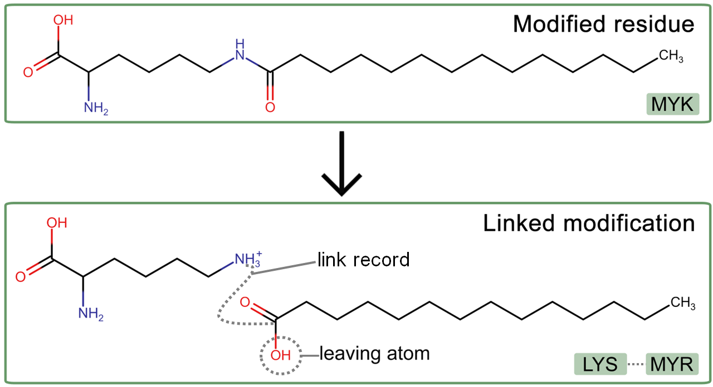
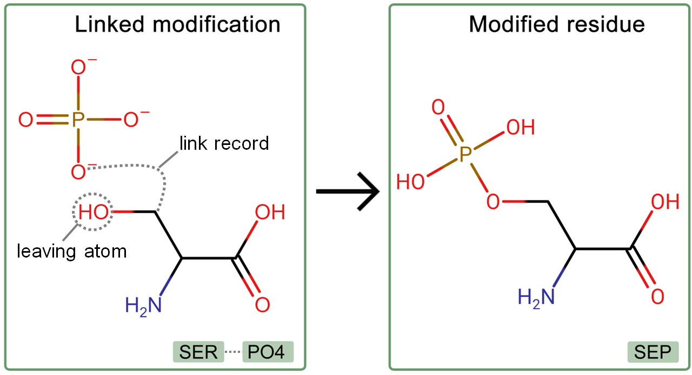

# Standardizing Protein Modifications

## Sections

- [Glossary of Terms](#glossary-of-terms)
- [Introduction](#introduction)
- [Splitting CCDs](#splitting-ccds)
- [Merging CCDs](#merging-ccds)
- [Replacing CCDs](#replacing-ccds)
- [Adding CCDs to Polypeptide Sequences](#adding-ccds-to-polypeptide-sequences)
- [Renaming CCDs](#renaming-ccds)
- [Changing CCD Parents](#changing-ccd-parents)
- [Acknowledgements](#acknowledgements)

## Glossary of Terms

PCM - Protein chemical modification 

PTM - Post-translational modification

## Introduction

The standardization of PCM handling ensures that there is a single 
correct approach to handling each PCM that occurs within the PDB 
archive. However, there are many existing PDB entries that contain PCMs
which do not follow these handling conventions. 

As part of the PCM remediation project, all entries containing protein 
modifications are being re-released to add the new PCM data category 
described [here](Protein_modifications.md). During this process, any PCMs
that are incorrectly handled within a PDB entry are amended to ensure that they are 
consistently handled. 

In this document, some examples are provided describing the processes that are being 
performed to standardize PCM handling in PDB entries.

## Splitting CCDs

In some instances, a single peptide residue CCD is inconsistently used to describe a 
linked modification. For example, the CCD MYK describes N6-Myristoyl-Lysine, however,
myristoylation is a lipid modification and must be handled as linked modification. In all
entries that contain MYK the following splitting process must be performed: 

| Existing CCD | \>  | New Peptide CCD | New Linked CCD | Example PDB Entry ID |
|--------------|-----|-----------------|----------------|----------------------|
| MYK          | \>  | LYS             | MYR            | 3U31                 |

## Merging CCDs

In some instances, a linked modification group is inconsistently used to describe a 
PCM that should be handled as a peptide residue within the polypeptide 
sequence. For example, phosphoserine can be inconsistently described 
using two CCDs, serine (SER) and phosphate (PO4) rather than the phosphoserine CCD (SEP).
This is because this is a 'Named protein modification' and so should be handled as a 
single CCD describing both the peptide residue and modification group. The following 
merging process must be performed in all of these cases: 

| Existing Peptide CCD | Existing Linked CCD | \>  | New CCD | Example PDB Entry ID |
|----------------------|---------------------|-----|---------|----------------------|
| SER                  | PO4                 | \>  | SEP     | 6FW5                 |

## Replacing CCDs

In some instances, a CCD ID is incorrectly used to describe a PCM where
another existing CCD already describes the modification. One example of this is the use 
of CCDs to describe Heme (HEM) and Heme C (HEC). HEM should be used exclusively to 
describe non-covalently bound heme, whereas HEC should be used to describe covalently 
bound heme C. However, there are many entries in which these are inconsistently used. 
The following replacement process must be performed in all of these cases:

| Existing CCD | \>  | New CCD | Example PDB Entry ID |
|--------------|-----|---------|----------------------|
| HEM          | \>  | HEC     | 19HC                 |

## Adding CCDs to Polypeptide Sequences

In some instances, a CCD is linked to the polypeptide rather than being part of the 
polypeptide sequence. This most often occurs to the terminal residues of the sequence 
and most commonly to the terminal caps ACE and NH2. The following addition process must
be performed in all of these cases:

| CCD | Current Handling             | \> | New Handling              | Example PDB Entry ID |
|-----|------------------------------|----|---------------------------|----------------------|
| ACE | Linked to peptide N-terminus | \> | Part of peptide sequence  | 1BHQ                 |
| NH2 | Linked to peptide C-terminus | \> | Part of peptide sequence  | 4TKY                 |

The opposite process can also occur, where a CCD should be removed from a polypeptide 
sequence. For example terminal myristoylation (MYR) is often inconsistently annotated as being 
part of the polypeptide sequence. The following removal process must be performed in all 
of these cases:

| CCD | Current Handling         | \> | New Handling                 | Example PDB Entry ID |
|-----|--------------------------|----|------------------------------|----------------------|
| MYR | Part of peptide sequence | \> | Linked to peptide N-terminus | 2NA0                 |

## Renaming CCDs

As part of the PCM remediation process, many CCDs that describe protein
modifications are being renamed to make them more findable and remove ambiguities in 
their naming. For example, the CCD MLZ describes the methylation of the side chain 
nitrogen of lysine, currently it is named 'N-METHYL-LYSINE' however this name is misleading, 
implying that the methylation occurs on the backbone nitrogen rather than the side chain 
nitrogen. It will be renamed in the following process:

| CCD | Current Name    | \> | New Name         | Example PDB Entry ID |
|-----|-----------------|----|------------------|----------------------|
| MLZ | N-METHYL-LYSINE | \> | N6-METHYL-LYSINE | 1IV8                 |

This naming must be reflected in all entries that contain the CCD MLZ.

## Changing CCD Parents

As part of the PCM remediation process, many CCDs that describe protein
modifications are having their parent residues updated. For example, the CCD SOQ is the 
CCD that describes N-METHYL-ASPARTIC ACID, however it is currently annotated as not 
having a parent residue. It is a natural modification to Aspartic acid and so the parent 
residue will be changed to ASP. The parent will be updated in the following process:

| CCD | Current Parent | \> | New Parent | Example PDB Entry ID |
|-----|----------------|----|------------|----------------------|
| SOQ | None           | \> | ASP        | 7AZ6                 |

This change in parent must be reflected in all entries that contain the CCD SOQ.

## Acknowledgements
The protein chemical modifications (PCMs) and post translational modifications (PTMs) 
remediation project is a wwPDB collaborative project carried out principally by 
[PDBe](https://www.ebi.ac.uk/pdbe/) at [EMBL-EBI](https://www.ebi.ac.uk/), and is funded 
by BBSRC grant number BB/V018779/1.
